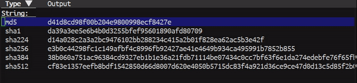

# test-sha
> Test ground for secure hash algorithms.

  

This package let you test a list of Cryptographic hash function (CHF) provided
by Emacs' secure hash algorithms.

## Todo List

- [ ] Customizable secure hash algorithms to list.

## Contribution

If you would like to contribute to this project, you may either
clone and make pull requests to this repository. Or you can
clone the project and establish your own branch of this tool.
Any methods are welcome!
